# pytest-CRUD-Framework - Architecture & Workflow

## System Architecture Overview

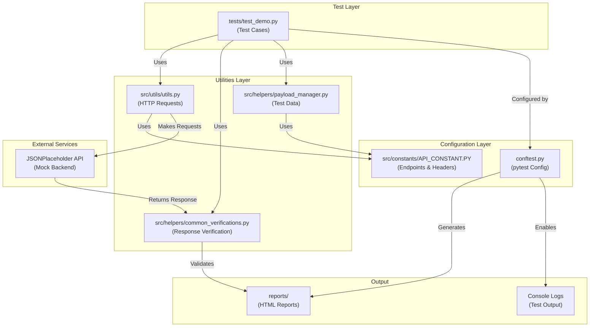

---

## Test Execution Flow - CRUD Operations

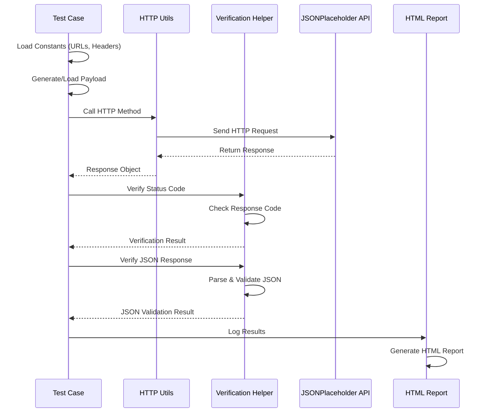

---

## Detailed Component Interaction Flow

```mermaid
graph LR
    subgraph "Input"
        Input["Test Execution<br/>pytest command"]
    end
    
    subgraph "Configuration"
        Conf["conftest.py<br/>- Setup logging<br/>- Configure HTML report<br/>- Set report path"]
    end
    
    subgraph "Test Discovery"
        Discover["pytest discovers<br/>tests/test_demo.py"]
    end
    
    subgraph "Import Constants"
        Import["Load from<br/>src/constants/<br/>API_CONSTANT.PY"]
    end
    
    subgraph "HTTP Request Processing"
        Req1["Call HTTP Method<br/>from utils.py"]
        Req2["Use Headers from<br/>API_CONSTANT.PY"]
        Req3["Send Request to<br/>JSONPlaceholder API"]
    end
    
    subgraph "Response Processing"
        Resp1["Receive Response"]
        Resp2["Log Response Status"]
        Resp3["Parse JSON Response"]
    end
    
    subgraph "Verification"
        Ver1["Verify Status Code<br/>using common_verifications.py"]
        Ver2["Verify Headers"]
        Ver3["Verify JSON Keys<br/>& Structure"]
    end
    
    subgraph "Test Result"
        Result["PASS / FAIL<br/>Assertion"]
    end
    
    subgraph "Reporting"
        Report["Generate HTML Report<br/>with Test Summary<br/>reports/report_*.html"]
    end
    
    Input --> Conf
    Conf --> Discover
    Discover --> Import
    Import --> Req1
    Req1 --> Req2
    Req2 --> Req3
    Req3 --> Resp1
    Resp1 --> Resp2
    Resp2 --> Resp3
    Resp3 --> Ver1
    Ver1 --> Ver2
    Ver2 --> Ver3
    Ver3 --> Result
    Result --> Report
```

---

## CRUD Operations Test Flow

```mermaid
graph TD
    Start["Test Execution Starts"]
    
    subgraph "CREATE"
        C1["1. Generate User Payload<br/>payload_manager.py"]
        C2["2. POST Request<br/>to /users"]
        C3["3. Verify Status 201"]
        C4["4. Verify Response<br/>Contains User Data"]
    end
    
    subgraph "READ"
        R1["1. GET All Users<br/>from /users"]
        R2["2. Verify Status 200"]
        R3["3. Verify Response<br/>is List of Users"]
        R4["1. GET User by ID<br/>from /users/1"]
        R5["2. Verify Status 200"]
        R6["3. Verify Response<br/>Contains User Object"]
    end
    
    subgraph "UPDATE"
        U1["1. Load Update Payload<br/>payload_manager.py"]
        U2["2. PUT Request<br/>to /users/1"]
        U3["3. Verify Status 200"]
        U4["4. Verify Response<br/>Contains Updated Data"]
    end
    
    subgraph "DELETE"
        D1["1. DELETE Request<br/>to /users/1"]
        D2["2. Verify Status 200"]
        D3["3. Verify User Deleted"]
    end
    
    Start --> C1
    C1 --> C2
    C2 --> C3
    C3 --> C4
    C4 --> R1
    R1 --> R2
    R2 --> R3
    R3 --> R4
    R4 --> R5
    R5 --> R6
    R6 --> U1
    U1 --> U2
    U2 --> U3
    U3 --> U4
    U4 --> D1
    D1 --> D2
    D2 --> D3
    D3 --> End["All Tests Complete<br/>Report Generated"]
    
    style C1 fill:#e1f5e1
    style R1 fill:#e1f5ff
    style U1 fill:#ffe1f5
    style D1 fill:#ffe1e1
```

---

## Data Flow - Request to Response

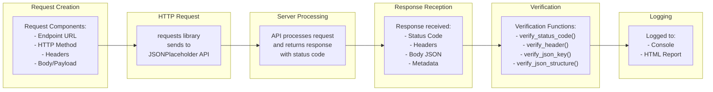

---

## Test Payload Generation Flow

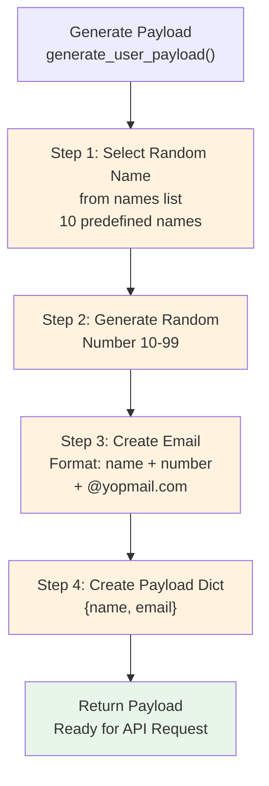

---

## Verification Strategy Flow

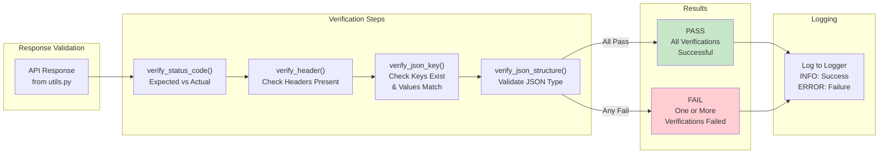

---

## File Import Dependency Graph

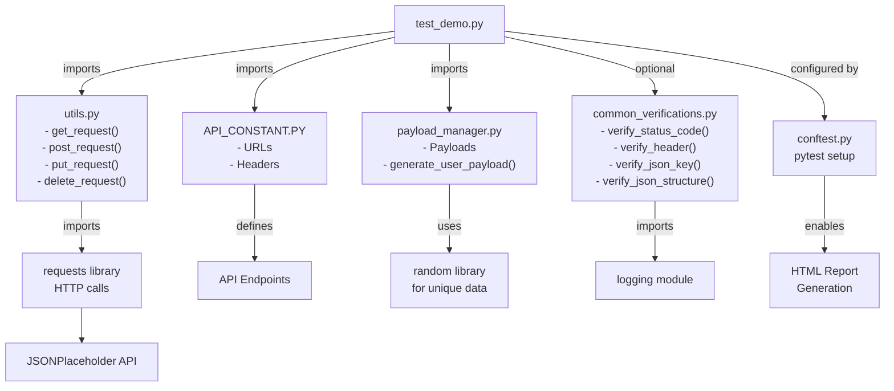

---

## Request Types & Response Expectations

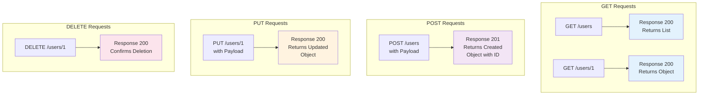

---

## Error Handling & Logging Flow

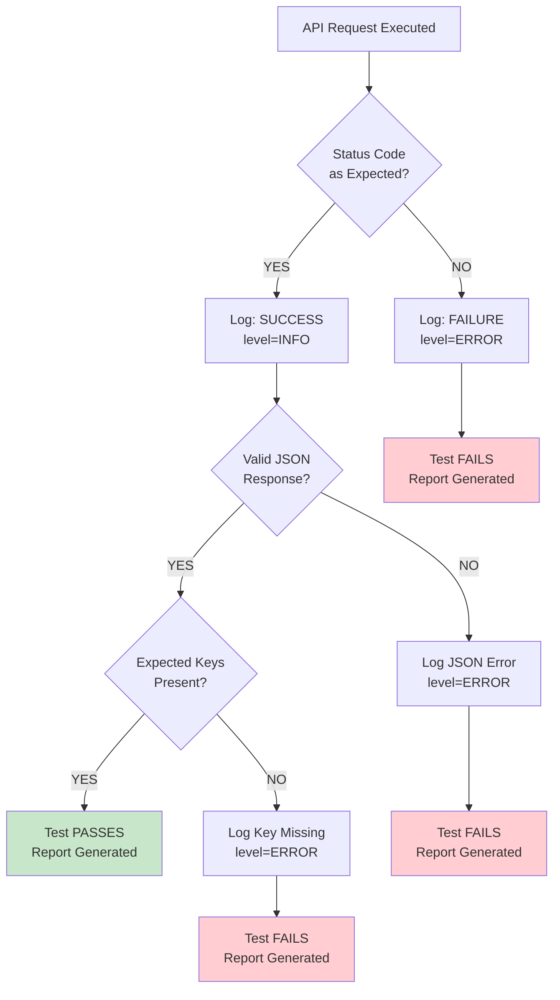

---

## Testing Workflow Summary

| Step | Component | Action | Output |
|------|-----------|--------|--------|
| 1 | conftest.py | Initialize pytest & logging | Configured environment |
| 2 | test_demo.py | Load test functions | Test discovery |
| 3 | API_CONSTANT.PY | Load URLs & headers | Configuration data |
| 4 | payload_manager.py | Generate test data | Request payload |
| 5 | utils.py | Make HTTP request | Response object |
| 6 | common_verifications.py | Validate response | Pass/Fail result |
| 7 | conftest.py | Generate report | HTML report file |

---

## Directory & Module Relationship

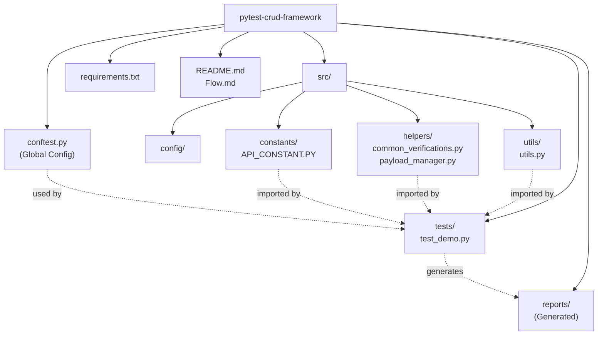

---

## Response Verification Chain

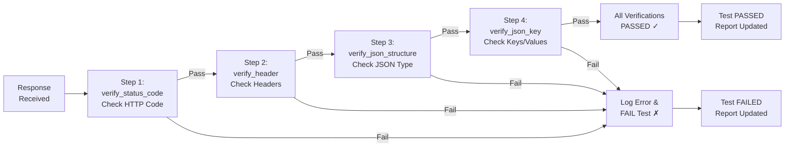

---

## Execution Timeline

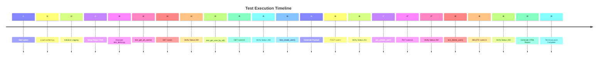

---

This documentation provides a comprehensive overview of how the pytest-CRUD-Framework operates, from test discovery through report generation.
